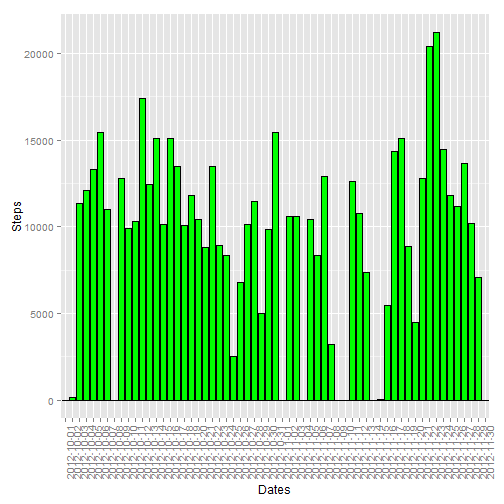
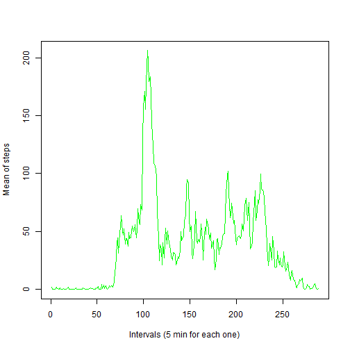
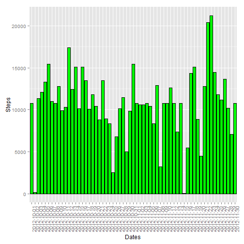
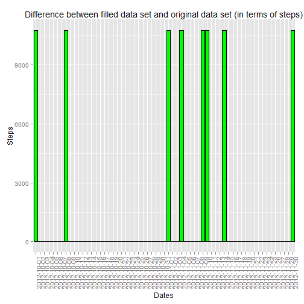

# Reproducible Research: Peer Assessment 1
## Loading and preprocessing the data

```r
data <- read.csv(unz("activity.zip", "activity.csv"))
```


## What is mean total number of steps taken per day?


```r
library(ggplot2)
#Selection of the steps by days
validData <- split(data, data$date)
#sum of the steps by day, without to consider the NA values
dailySteps <- lapply(validData, function(x) sum(x$steps, na.rm=TRUE))
#Creation of a vector of result, instead of a list
stepsSum <- unlist(dailySteps)

qplot(names(stepsSum), stepsSum, ylab="Steps", xlab="Dates", geom="histogram", stat="identity") + geom_bar(stat="identity", colour="black", fill="green") + theme(axis.text.x = element_text(angle = 90, hjust = 1))
```

 

```r
#here the total of mean and median of steps per day
mean(stepsSum)
```

```
## [1] 9354
```

```r
median(stepsSum)
```

```
## [1] 10395
```

## What is the average daily activity pattern?


```r
#Selection of the steps by time interval
validData <- split(data, data$interval)
#means of the steps by slots of time, without to consider the NA values
dailySteps <- lapply(validData, function(x) mean(x$steps, na.rm=TRUE))
#Creation of a vector of result, instead of a list
stepsMean <- unlist(dailySteps)

plot(stepsMean, type="l", ylab="Mean of steps", xlab="Intervals (5 min for each one)", col="green")
```

 

```r
#name of the interval with the maximum number of steps
names(stepsMean)[match(max(stepsMean),stepsMean)]
```

```
## [1] "835"
```


## Imputing missing values


```r
#Find the total missing values, that are only in the column steps
sum(is.na(data$steps))
```

```
## [1] 2304
```

```r
#Creation of a dataset without missing values (sobstituted by the means of the corrispondent interval)
dataMod <- data
for(i in 1:nrow(dataMod)) {
    if (is.na(dataMod$steps[i]))
    dataMod$steps[i] <- stepsMean[match(dataMod$interval[i], names(stepsMean))]
}
```

###Here we find the plot divided by days of the sum of steps, considering the dataset with the NA approximated

```r
#Selection of the steps by days
validData <- split(dataMod, dataMod$date)
#sum of the steps by day
dailySteps <- lapply(validData, function(x) sum(x$steps, na.rm=TRUE))
#Creation of a vector of result, instead of a list
stepsSumAd <- unlist(dailySteps)

qplot(names(stepsSumAd), stepsSumAd, ylab="Steps", xlab="Dates", geom="histogram", stat="identity") + geom_bar(stat="identity", colour="black", fill="green") + theme(axis.text.x = element_text(angle = 90, hjust = 1))
```

 

```r
#here the total of mean and median of steps per day
mean(stepsSumAd)
```

```
## [1] 10766
```

```r
median(stepsSumAd)
```

```
## [1] 10766
```

###The NA values modified have impact on 8.


```r
#let's investigate the differences between table without NA and with NA adjusted
diff <- stepsSumAd - stepsSum

qplot(names(stepsSumAd), diff, main="Difference between filled data set and original data set (in terms of steps)", ylab="Steps", xlab="Dates", geom="histogram", stat="identity") + geom_bar(stat="identity", colour="black", fill="green") + theme(axis.text.x = element_text(angle = 90, hjust = 1))
```

 

```r
differentDays <- sum(diff!=0)
```

## Are there differences in activity patterns between weekdays and weekends?


```r
dataMod$daytype <- ifelse(weekdays(as.Date(dataMod$date)) %in% c("sabato", "domenica"),"weekend", "weekday")

#let's print the values
library(lattice)
library(bear)
dataInfo <- summarySE(data=dataMod, measurevar="steps", groupvars=c("daytype", "interval"), na.rm=FALSE, conf.interval=.95)
xyplot(steps~interval|daytype,data=dataInfo,type="l",layout=c(1,2))
```

 
